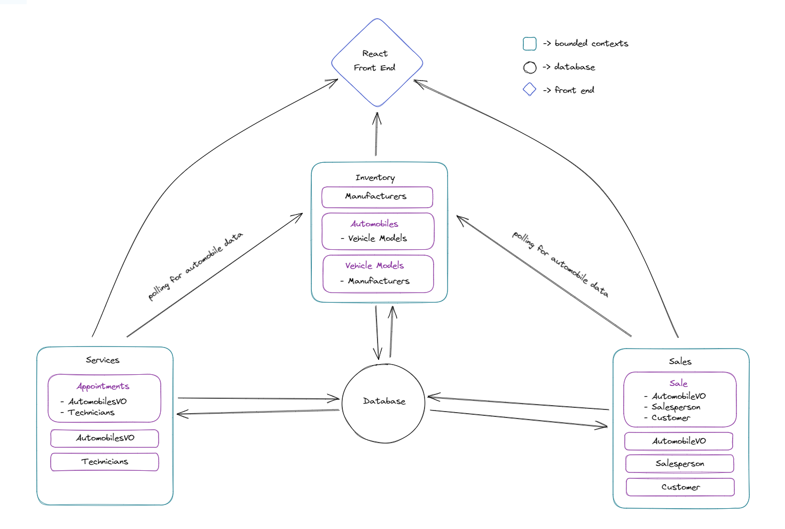

# CarCar

Team:

* Person 1 - Brandon Dinh (Service microservice)
* Person 2 - Aaron Tran (Sales microservice)
* Person 3 - Adrianna Helfrich (Sales microservice)

## Design

### Installation

Fork and Clone the Repository. \
In your command line run the following snippets of code:
- Create the Docker Volume required for Project Beta
`docker volume create beta-data`
- Build docker images
`docker-compose build`
- Starts and runs docker containers
`docker-compose up`

Depending on which version of the application you would like to run, switch to either of these branches:
- `git checkout main` (Brandon & Adrianna)
- `git checkout main2` (Brandon & Aaron)

### Diagram of Architecture


### URLs & Ports for Microservices
**Inventory-API** \
URL: http://localhost:8100/ \
Ports: 8100:8000

**Sales-API** \
URL: http://localhost:8090/ \
Ports: 8090:8000

**Service-API** \
URL: http://localhost:8080/ \
Ports: 8080:8000

**React** \
URL: http://localhost:3000/ \
Ports: 3000:3000

**Database** \
URL: http://localhost:15432:5432/ \
Ports: 15432:5432


### CRUD Routes
#### Manufacturer
**POST** \
URL: http://localhost:8100/manufacturers/:id/ \
Description: Creates a manufacturer \
Sample POST Data:
```
    {
        “name”: “manufacturer_name”
    }

```
Expected Response Data Example:
```
    {
        “href”: “/api/manufacturers/1/”,
        “id”: 1,
        “name”: “manufacturer_name”
    }
```
**GET** \
URL: http://localhost:8100/manufacturers/ \
Description: Grabs the list of manufacturers \
Expected Response Data:
```
{
    “manufacturers”: [
        {
            “href”: “/api/manufacturers/1/”,
            “id”: 1,
            “name”: “manufacturer_name”
        }
    ]
}

```
**GET** \
URL: http://localhost:8100/manufacturers/:id/ \
Description: Grabs a specific manufacturer \
Expected Response Data:
```
{
    “href”: “/api/manufacturers/1/”,
    “id”: 1,
    “name”: “manufacturer_name”
}

```
**PUT** \
URL: http://localhost:8100/manufacturers/:id/ \
Description: Updates a specific manufacturer \
Sample PUT Data:
```
    {
        “name”: “manufacturer_name”
    }
```
Expected Response Data:
```
    {
        “href”: “/api/manufacturers/1/”,
        “id”: 1,
        “name”: “manufacturer_name”
    }

```
**DELETE** \
URL: http://localhost:8100/manufacturers \
Description: Deletes a specific manufacturer \
Expected Response Data:
```
{
    “id”: null,
    “name”: “manufacturer_name”
}
```
#### Vehicle Models
**POST** \
URL: http://localhost:8100/api/models/ \
Description: Creates a vehicle model \

Sample POST Data
```
{
  "name": "Sebring",
  "picture_url": "https://upload.wikimedia.org/wikipedia/commons/thumb/7/71/Chrysler_Sebring_front_20090302.jpg",
  "manufacturer_id": 1
}

```
Expected Response Data:
```
{
	"href": "/api/models/1/",
	"id": 1,
	"name": "Sebring",
	"picture_url": "https://upload.wikimedia.org/wikipedia/commons/thumb/7/71/Chrysler_Sebring_front_20090302.jpg",
	"manufacturer": {
		"href": "/api/manufacturers/1/",
		"id": 1,
		"name": "Honda"
	}
}
```

**GET** \
URL: http://localhost:8100/api/models/ \
Description: List all vehicle models \
Expected Response Data Example:
```
{
	"models": [
		{
			"href": "/api/models/1/",
			"id": 1,
			"name": "Sebring",
			"picture_url": "https://upload.wikimedia.org/wikipedia/commons/thumb/7/71/Chrysler_Sebring_front_20090302.jpg/320px-Chrysler_Sebring_front_20090302.jpg",
			"manufacturer": {
				"href": "/api/manufacturers/1/",
				"id": 1,
				"name": "Chrysler"
			}
		},
		{
			"href": "/api/models/3/",
			"id": 3,
			"name": "Sebring",
			"picture_url": "https://upload.wikimedia.org/wikipedia/commons/thumb/7/71/Chrysler_Sebring_front_20090302.jpg/320px-Chrysler_Sebring_front_20090302.jpg",
			"manufacturer": {
				"href": "/api/manufacturers/1/",
				"id": 1,
				"name": "Chrysler"
			}
		},
		{
			"href": "/api/models/4/",
			"id": 4,
			"name": "Tundra",
			"picture_url": "https://cdn.shopify.com/s/files/1/0175/8496/products/color_blackwhite_1_reid_sneakers_800x800.jpg?v=1618340529",
			"manufacturer": {
				"href": "/api/manufacturers/2/",
				"id": 2,
				"name": "Toyota"
			}
		}
	]
}

```

**GET** \
URL: http://localhost:8100/api/models/:id/ \
Description: List specific vehicle models \
Expected Response Data Example:
```
{
	"href": "/api/models/1/",
	"id": 1,
	"name": "Sebring",
	"picture_url": "https://upload.wikimedia.org/wikipedia/commons/thumb/7/71/Chrysler_Sebring_front_20090302.jpg/320px-Chrysler_Sebring_front_20090302.jpg",
	"manufacturer": {
		"href": "/api/manufacturers/1/",
		"id": 1,
		"name": "Chrysler"
	}
}

```

**PUT** \
URL: http://localhost:8100/api/models/:id/ \
Description: Update specific vehicle models \
Expected Response Data Example:
```
{
	"href": "/api/models/1/",
	"id": 1,
	"name": "Tundra",
	"picture_url": "https://upload.wikimedia.org/wikipedia/commons/thumb/7/71/Chrysler_Sebring_front_20090302.jpg/320px-Chrysler_Sebring_front_20090302.jpg",
	"manufacturer": {
		"href": "/api/manufacturers/1/",
		"id": 1,
		"name": "Chrysler"
	}
}

```

**DELETE** \
URL: http://localhost:8100/api/models/:id/ \
Description: Delete specific vehicle model \
Expected Response Data Example:
```
{
	"message": "Successfully deleted."
}

```


**Placeholder Method** \
URL: \
Description: \
Sample CRUD Data:
```
Code block
```
Expected Response Data:
```
Code block
```

### Value Objects

Sales-Api (**AutomobileVO**)
-  Through the use of our defined poller, we are able to poll automobile information from Inventory-API and create value object models with **import_href**, **vin**, and **sold** properties
- **Import_href** serves as the backend value that is used to reference the AutomobileVO object in our CRUD requests
- **Vin** is used for user-friendly display of data in front-end forms
- **Sold** property allows admin to accurately make sell requests with cars that have not been sold


## Service microservice

Explain your models and integration with the inventory
microservice, here.

## Sales microservice

Explain your models and integration with the inventory
microservice, here.
